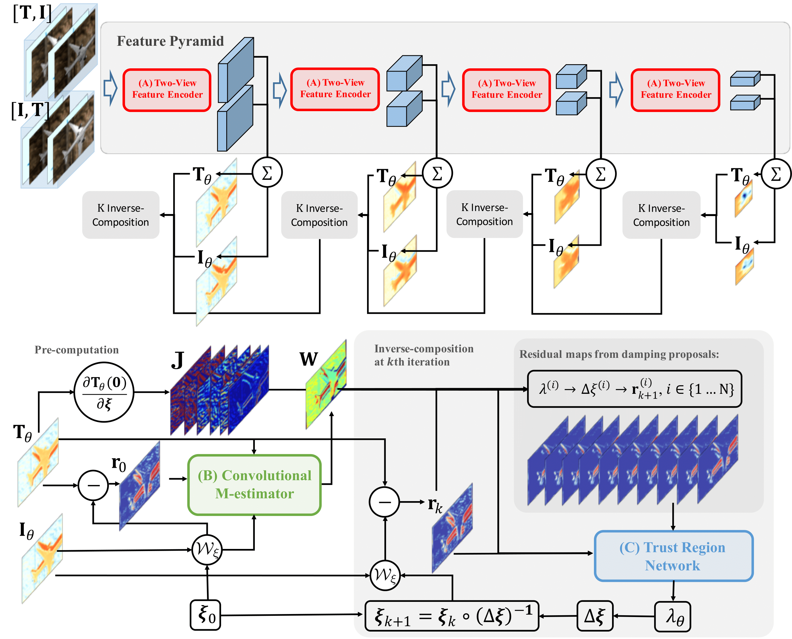

# Taking a Deeper Look at the Inverse Compositional Algorithm (CVPR 2019, Oral Presentation)



## Summary 

This is the official repository of our CVPR 2019 paper:

**Taking a Deeper Look at the Inverse Compositional Algorithm**,
*Zhaoyang Lv, Frank Dellaert, James M. Rehg, Andreas Geiger*,
CVPR 2019
 * [Preprint (PDF)][1]
 * [Video talk][2]

```bibtex
@inproceedings{Lv19cvpr,  
  title     = {Taking a Deeper Look at the Inverse Compositional Algorithm}, 
  author    = {Lv, Zhaoyang and Dellaert, Frank and Rehg, James and Geiger, Andreas},  
  booktitle = {CVPR},  
  year      = {2019}  
}
```

### Project Members

* [Zhaoyang Lv][3], Georgia Institute of Technology (Ph.D. student), Max Planck Institute (Alumni)
* [Frank Dellaert][4], Georgia Institute of Technology
* [James M. Rehg][5], Georgia Institute of Technology
* [Andreas Geiger][6], Max Planck Institute, University of Tuebingen

### Contact

Please drop me an email if you have any questions regarding this project. Please also do not hesitate to contact me if you have any requests for your current projects before you have access to the code.

Zhaoyang Lv (zhaoyang.lv@gatech.edu, lvzhaoyang1990@gmail.com)

### Setup 

The code is developed using Pytorch 1.0, CUDA 9.0, Ubuntu16.04. Pytorch > 1.0 and Cuda > 9.0 were also tested in some machines. If you need to integrate to some code bases which are using Pytorch < 1.0, note that some functions (particularly the matrix inverse operator) are not backward compatible. Contact me if you need some instructions.

You can reproduce the setup by using our anaconda environment configurations 

``` bash!
conda env create -f setup/environment.yml
```

### Quick Inference Example

### Prepare the datasets

**TUM RGBD Dataset**: Download the dataset from [TUM RGBD][7] to '$YOUR_TUM_RGBD_DIR'. Create a symbolic link to the data directory as 

```
ln -s $YOUR_TUM_RGBD_DIR code/data/data_tum
```

**MovingObjects3D Dataset** Download the dataset from [MovingObjs3D][8] to '$YOUR_MOV_OBJS_3D_DIR'. Create a symbolic link to the data directory as 

```
ln -s $YOUR_MOV_OBJS_3D_DIR code/data/data_objs3D
```

### Run training

**Train example with TUM RGBD dataset:** 

``` bash! 
python train.py --dataset TUM_RGBD 

# or run with the specific setting
python train.py --dataset TUM_RGBD \
--encoder_name ConvRGBD2 \
--mestimator MultiScale2w \
--solver Direct-ResVol \
--keyframes 1,2,4,8 
```

To check the full training setting, run the help config as 
``` bash!
python train.py --help
``` 

Use tensorboard to check the progress during training
``` bash!
tensorboard --log logs/TUM_RGBD --port 8000 # go to localhost:8000 to check the training&validation curve
```

**Train example with MovingObjects3D:** All the same as the last one only except changing the dataset name

``` bash!
python train.py --dataset MovingObjs3D 

# check the training progress using tensorboard
tensorboard --log logs/MovingObjs3D --port 8001
```

We will soon release the instructions for the other two datasets used in the paper, data in the BundleFusion and DynamicBundleFusion.

### Run evaluation with the pretrained models 

**Run the pretrained model:** If you have set up the dataset properly with the datasets, you can run the learned model with the checkpoint we provided in the trained model directory 

``` bash!
python evaluate.py --dataset TUM_RGBD \
--trajectory fr1/rgbd_dataset_freiburg1_360 \
--encoder_name ConvRGBD2 \
--mestimator MultiScale2w \
--solver Direct-ResVol \
--keyframes 1 # optionally 1,2,4,8 \
--checkpoint trained_models/TUM_RGBD_ABC_final.pth.tar
```

You can substitute the trajectory, the keyframe and the checkpoint file. The training and evaluation share the same config setting. To check the full setting, run the help config as

``` bash!
python evaluate.py --help
```

**Run a baseline:** We provide the vanilla Lucas-Kanade method minizing the photometric error without any learning module. Note that it is **not** the [RGBD VO baseline][9] we report in the paper. It is not the optimal Lucas-Kanade baseline since we use the same stopping criterion, Gauss-Newton solver within the same framework as our learned model, which does not contain extra bells and whistles.

``` bash!
python evaluate.py --dataset TUM_RGBD \
--trajectory fr1/rgbd_dataset_freiburg1_360 \
--encoder_name RGB --mestimator None --solve Direct-Nodamping \
--keyframes 1 # optionally 1,2,4,8, etc.
```

[1]: https://arxiv.org/pdf/1812.06861.pdf
[2]: https://youtu.be/doTjXDFtyK0
[3]: https://www.cc.gatech.edu/~zlv30/
[4]: https://www.cc.gatech.edu/~dellaert/FrankDellaert/Frank_Dellaert/Frank_Dellaert.html
[5]: https://rehg.org/
[6]: http://www.cvlibs.net/
[7]: https://vision.in.tum.de/data/datasets/rgbd-dataset/download
[8]: 
[9]: https://vision.cs.tum.edu/_media/spezial/bib/steinbruecker_sturm_cremers_iccv11.pdf 